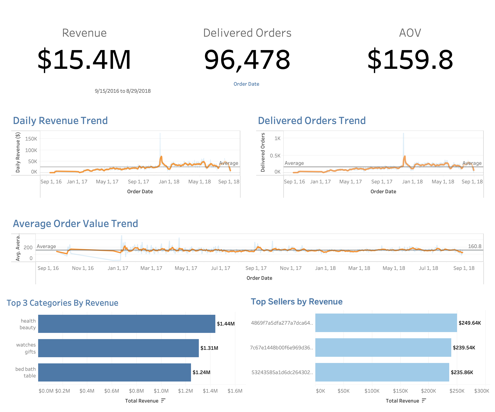
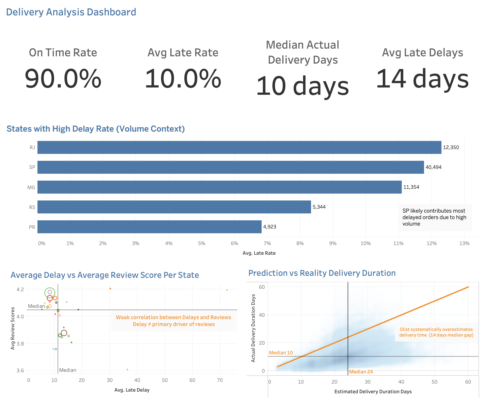
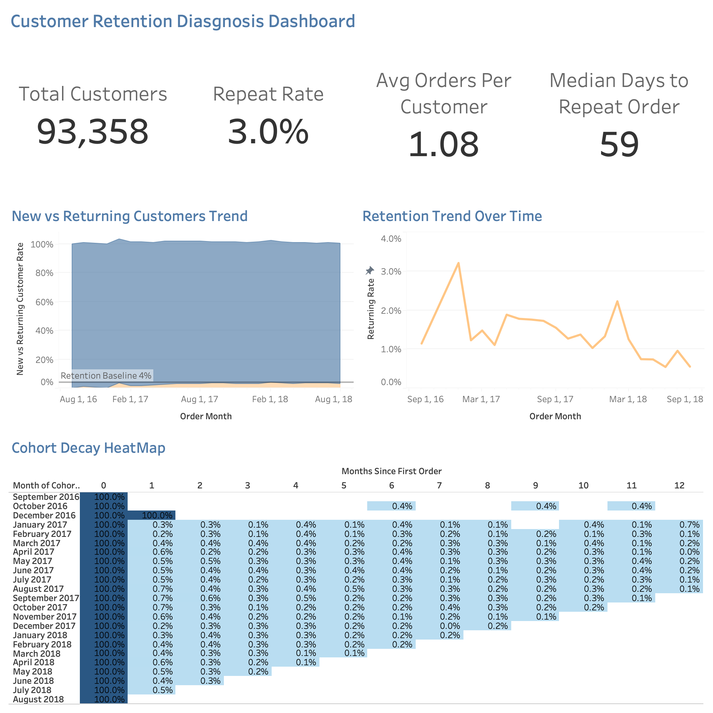

# Olist Analytics Engineering Pipeline

## Overview
This project is an **end-to-end analytics engineering pipeline** built on the Olist Brazilian e-commerce dataset.

It demonstrates how raw operational data can be ingested, orchestrated, modeled, tested, and served for business analytics using a modern data stack.

The project focuses on production-style analytics engineering practices: reproducible infrastructure, scheduled workflows, dimensional modeling, data quality checks, business KPIs, and dashboard-ready marts.

---

## What This Project Demonstrates
- Building a reproducible Docker-based analytics environment
- Orchestrating ingestion and transformation workflows with Apache Airflow
- Loading raw CSV data into PostgreSQL
- Modeling warehouse layers with dbt
- Designing staging models, facts, dimensions, and metrics
- Applying dbt tests for data quality and relationship validation
- Creating Tableau dashboards for executive, delivery, and customer retention analysis
- Translating data models into business KPIs and insights

---

## Architecture
Raw CSV Files

Airflow DAG

Python Ingestion Scripts

PostgreSQL Raw Schema

dbt Staging Models

dbt Marts: Facts, Dimensions, Metrics

Tableau Dashboards

---

## Tech Stack

### Data Engineering & Orchestration
- **Python** - raw data ingestion
- **Apache Airflow** - workflow orchestration
- **Docker** - local reproducible environment
- **PostgreSQL** - analytics warehouse

### Analytics Engineering
- **dbt Core** - transformations, tests, and documentation
- **SQL** - dimensional modeling and KPI logic

### Analytics & Visualization
- **Tableau** - dashboards and business insights
- **Git & GitHub** - version control and project documentation

---

## Data Source
**Olist Brazilian E-Commerce Dataset**

Source:
- https://www.kaggle.com/datasets/olistbr/brazilian-ecommerce

The dataset contains real e-commerce transactions, customers, sellers, products, payments, deliveries, and reviews. Its relational structure makes it useful for realistic data modeling and business analytics.

---

## Orchestration
The Airflow DAG `olist_analytics_pipeline` coordinates the main pipeline workflow:

- ingest raw CSV files into PostgreSQL
- install dbt package dependencies
- build and test dbt models
- generate dbt documentation

This makes the project runnable as a repeatable pipeline instead of a set of disconnected scripts.

---

## Data Model
The dbt project organizes the warehouse into analytics-ready layers:

- **Raw schema** - source tables loaded from CSV files
- **Staging models** - cleaned and standardized source models
- **Intermediate models** - reusable business logic for marts
- **Facts** - transactional tables for orders, payments, delivery, and order items
- **Dimensions** - descriptive entities such as customers, sellers, products, and dates
- **Metrics marts** - business-facing tables for revenue, customer behavior, delivery SLA, seller scorecards, and product category performance

---

## Business Questions

### Revenue & Orders
- What are daily, weekly, and monthly revenue trends?
- What is the average order value?
- Which product categories generate the most revenue?

### Customer Behavior
- How many customers are new vs returning each month?
- What is the repeat purchase rate?
- How long does it take customers to place a second order?

### Operations & Delivery
- What percentage of orders are delivered on time?
- What is the average delivery duration?
- Which regions experience the most delays?

### Seller & Product Performance
- Which sellers generate the most revenue?
- Which product categories perform best?
- How do reviews correlate with delivery performance?

---

## Key KPIs
- Total revenue
- Average order value
- Order volume
- On-time delivery rate
- Average delivery duration
- Late delivery rate
- Repeat purchase rate
- New vs returning customers
- Seller revenue contribution
- Product category performance

---

## Local Setup
This project uses **PostgreSQL and Airflow running in Docker** for reproducibility.

Start the local services:

```bash
docker compose up -d
```

Airflow is available at:

```text
http://localhost:8080
```

Default local credentials:

```text
Username: airflow
Password: airflow
```

Run dbt checks from the scheduler container:

```bash
docker compose exec airflow_scheduler dbt debug
```

---

## Dashboards

### Dashboard Screenshots
**Executive Dashboard**



**Delivery Analysis Dashboard**



**Customer Retention Analysis Dashboard**



### Live Dashboards
- **Executive Dashboard:** [Executive Dashboard](https://public.tableau.com/app/profile/gideon.kipkorir/viz/Olist_executive_dashbaord/executive-dashboard)
- **Delivery Analysis Dashboard:** [Delivery Analysis](https://public.tableau.com/app/profile/gideon.kipkorir/viz/Olist_delivery_analysis/delivery-dashboard)
- **Customer Retention Analysis Dashboard:** [Customer Retention Analysis](https://public.tableau.com/app/profile/gideon.kipkorir/viz/olist-customer-behavior-dashboard/CustomerRetentionDiagnosisDashboard)

---

## Key Insights

### Revenue & Business Performance
- Revenue trends upward over time, with occasional spikes driven by order volume and category performance.
- Average order value remains relatively stable.
- Revenue is concentrated across a smaller group of high-performing product categories and sellers.

### Delivery & Operations
- Olist maintains a high on-time delivery rate, partly because estimated delivery dates are conservative.
- Early deliveries are common, with many orders arriving before the estimated delivery date.
- Delay volume is often driven by order concentration in high-volume states rather than poor regional performance alone.

### Customer Behavior
- Repeat purchase rate is very low, showing that the business depends heavily on new customer acquisition.
- Most customers purchase only once, limiting customer lifetime value.
- Customer retention does not materially improve across cohorts, suggesting weak repeat-purchase behavior.

### Customer Experience
- Delivery delays have a weak relationship with review scores.
- Customer satisfaction remains relatively strong despite delivery variability, suggesting reviews are influenced by more than logistics alone.

---

## Project Outcome
This project demonstrates the full analytics engineering lifecycle: ingesting raw operational data, orchestrating repeatable workflows, transforming data into governed analytical models, validating quality with dbt tests, and presenting business insights through dashboards.
